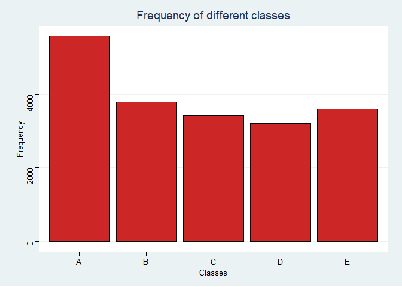
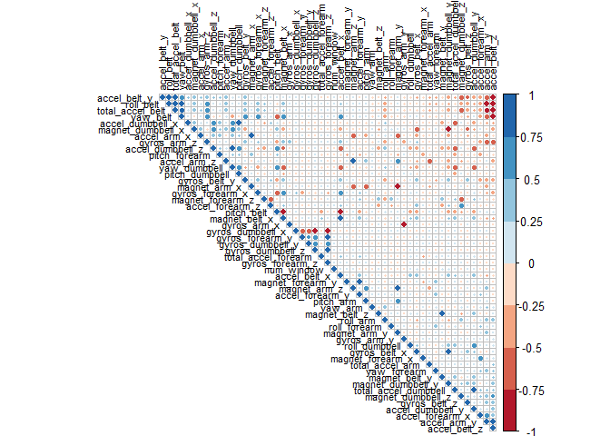
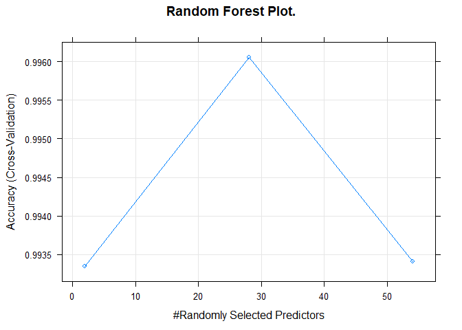
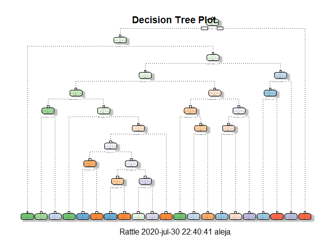
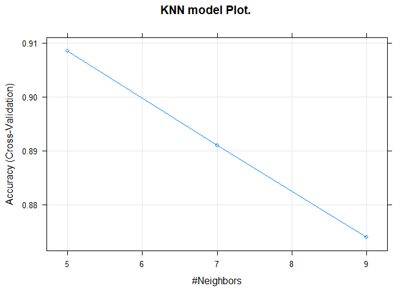

Overview
--------

This document aims to show the manner in which 6 participants performed
some exercise.

Using devices such as Jawbone Up, Nike FuelBand, and Fitbit it is now
possible to collect a large amount of data about personal activity
relatively inexpensively. These type of devices are part of the
quantified self movement – a group of enthusiasts who take measurements
about themselves regularly to improve their health, to find patterns in
their behavior, or because they are tech geeks. One thing that people
regularly do is quantify how much of a particular activity they do, but
they rarely quantify how well they do it. In this project, your goal
will be to use data from accelerometers on the belt, forearm, arm, and
dumbell of 6 participants. They were asked to perform barbell lifts
correctly and incorrectly in 5 different ways. More information is
available from the website here:
<a href="http://groupware.les.inf.puc-rio.br/har" class="uri">http://groupware.les.inf.puc-rio.br/har</a>
(see the section on the Weight Lifting Exercise Dataset).

Data
----

The data for this project come from this
[source](http://groupware.les.inf.puc-rio.br/har).

The training and test data for this project are available here:

\*[Training
Data](https://d396qusza40orc.cloudfront.net/predmachlearn/pml-training.csv)

\*[Test
Data](https://d396qusza40orc.cloudfront.net/predmachlearn/pml-testing.csv)

Goal of the Project.
--------------------

The goal of this project is to predict the manner in which they did the
exercise. This is the “classe” variable in the training set. It may use
any of the other variables to predict with. Must create a report
describing how was builded the model, how was used cross validation,
what was thought the expected out of sample error is, and why was made
the choices made. It will also use the prediction model to predict 20
different test cases.

### Packages

``` r
library(data.table)
library(caret)
library(dplyr)
library(ggthemes)
library(corrplot)
library(RColorBrewer)
library(rpart)
library(rattle)
library(gbm)
library(MASS)
```

Download and Store data.
------------------------

Download and check the files will be in the specify work directory.

``` r
setwd("C:/Users/aleja/Documents/Cursos/Coursera R pratices/Prediction Assignment Writeup")
```

``` r
train_url<-"https://d396qusza40orc.cloudfront.net/predmachlearn/pml-training.csv"
test_url<-"https://d396qusza40orc.cloudfront.net/predmachlearn/pml-testing.csv"
```

``` r
ifelse(!dir.exists(file.path(getwd(), "Data")), 
       dir.create(file.path(getwd(), "Data")), FALSE)
```

Download the databases and save them in the correct file.

``` r
download.file(url = train_url, destfile = file.path("./Data", "self_movement_train_data.csv"), 
              method = "curl")

download.file(url = test_url, destfile = file.path("./Data", "self_movement_test_data.csv"), 
              method = "curl")
```

Verify that the databases were downloaded correctly.

``` r
list.files("./Data")
```

    ## [1] "self_movement_test_data.csv"  "self_movement_train_data.csv"

Data Processing
---------------

It will always be necessary to organize and arrange the database with
which to work.

``` r
fread("./Data/self_movement_train_data.csv")->train_df
fread("./Data/self_movement_test_data.csv")->test_df
```

The train and test files have a lot of columns that contains only NA’s,
thus, these columns will be dispensed.

``` r
str(train_df)
```

    ## Classes 'data.table' and 'data.frame':   19622 obs. of  160 variables:
    ##  $ V1                      : int  1 2 3 4 5 6 7 8 9 10 ...
    ##  $ user_name               : chr  "carlitos" "carlitos" "carlitos" "carlitos" ...
    ##  $ raw_timestamp_part_1    : int  1323084231 1323084231 1323084231 1323084232 1323084232 1323084232 1323084232 1323084232 1323084232 1323084232 ...
    ##  $ raw_timestamp_part_2    : int  788290 808298 820366 120339 196328 304277 368296 440390 484323 484434 ...
    ##  $ cvtd_timestamp          : chr  "05/12/2011 11:23" "05/12/2011 11:23" "05/12/2011 11:23" "05/12/2011 11:23" ...
    ##  $ new_window              : chr  "no" "no" "no" "no" ...
    ##  $ num_window              : int  11 11 11 12 12 12 12 12 12 12 ...
    ##  $ roll_belt               : num  1.41 1.41 1.42 1.48 1.48 1.45 1.42 1.42 1.43 1.45 ...
    ##  $ pitch_belt              : num  8.07 8.07 8.07 8.05 8.07 8.06 8.09 8.13 8.16 8.17 ...
    ##  $ yaw_belt                : num  -94.4 -94.4 -94.4 -94.4 -94.4 -94.4 -94.4 -94.4 -94.4 -94.4 ...
    ##  $ total_accel_belt        : int  3 3 3 3 3 3 3 3 3 3 ...
    ##  $ kurtosis_roll_belt      : num  NA NA NA NA NA NA NA NA NA NA ...
    ##  $ kurtosis_picth_belt     : num  NA NA NA NA NA NA NA NA NA NA ...
    ##  $ kurtosis_yaw_belt       : num  NA NA NA NA NA NA NA NA NA NA ...
    ##  $ skewness_roll_belt      : num  NA NA NA NA NA NA NA NA NA NA ...
    ##  $ skewness_roll_belt.1    : num  NA NA NA NA NA NA NA NA NA NA ...
    ##  $ skewness_yaw_belt       : num  NA NA NA NA NA NA NA NA NA NA ...
    ##  $ max_roll_belt           : num  NA NA NA NA NA NA NA NA NA NA ...
    ##  $ max_picth_belt          : int  NA NA NA NA NA NA NA NA NA NA ...
    ##  $ max_yaw_belt            : num  NA NA NA NA NA NA NA NA NA NA ...
    ##  $ min_roll_belt           : num  NA NA NA NA NA NA NA NA NA NA ...
    ##  $ min_pitch_belt          : int  NA NA NA NA NA NA NA NA NA NA ...
    ##  $ min_yaw_belt            : num  NA NA NA NA NA NA NA NA NA NA ...
    ##  $ amplitude_roll_belt     : num  NA NA NA NA NA NA NA NA NA NA ...
    ##  $ amplitude_pitch_belt    : int  NA NA NA NA NA NA NA NA NA NA ...
    ##  $ amplitude_yaw_belt      : num  NA NA NA NA NA NA NA NA NA NA ...
    ##  $ var_total_accel_belt    : num  NA NA NA NA NA NA NA NA NA NA ...
    ##  $ avg_roll_belt           : num  NA NA NA NA NA NA NA NA NA NA ...
    ##  $ stddev_roll_belt        : num  NA NA NA NA NA NA NA NA NA NA ...
    ##  $ var_roll_belt           : num  NA NA NA NA NA NA NA NA NA NA ...
    ##  $ avg_pitch_belt          : num  NA NA NA NA NA NA NA NA NA NA ...
    ##  $ stddev_pitch_belt       : num  NA NA NA NA NA NA NA NA NA NA ...
    ##  $ var_pitch_belt          : num  NA NA NA NA NA NA NA NA NA NA ...
    ##  $ avg_yaw_belt            : num  NA NA NA NA NA NA NA NA NA NA ...
    ##  $ stddev_yaw_belt         : num  NA NA NA NA NA NA NA NA NA NA ...
    ##  $ var_yaw_belt            : num  NA NA NA NA NA NA NA NA NA NA ...
    ##  $ gyros_belt_x            : num  0 0.02 0 0.02 0.02 0.02 0.02 0.02 0.02 0.03 ...
    ##  $ gyros_belt_y            : num  0 0 0 0 0.02 0 0 0 0 0 ...
    ##  $ gyros_belt_z            : num  -0.02 -0.02 -0.02 -0.03 -0.02 -0.02 -0.02 -0.02 -0.02 0 ...
    ##  $ accel_belt_x            : int  -21 -22 -20 -22 -21 -21 -22 -22 -20 -21 ...
    ##  $ accel_belt_y            : int  4 4 5 3 2 4 3 4 2 4 ...
    ##  $ accel_belt_z            : int  22 22 23 21 24 21 21 21 24 22 ...
    ##  $ magnet_belt_x           : int  -3 -7 -2 -6 -6 0 -4 -2 1 -3 ...
    ##  $ magnet_belt_y           : int  599 608 600 604 600 603 599 603 602 609 ...
    ##  $ magnet_belt_z           : int  -313 -311 -305 -310 -302 -312 -311 -313 -312 -308 ...
    ##  $ roll_arm                : num  -128 -128 -128 -128 -128 -128 -128 -128 -128 -128 ...
    ##  $ pitch_arm               : num  22.5 22.5 22.5 22.1 22.1 22 21.9 21.8 21.7 21.6 ...
    ##  $ yaw_arm                 : num  -161 -161 -161 -161 -161 -161 -161 -161 -161 -161 ...
    ##  $ total_accel_arm         : int  34 34 34 34 34 34 34 34 34 34 ...
    ##  $ var_accel_arm           : num  NA NA NA NA NA NA NA NA NA NA ...
    ##  $ avg_roll_arm            : num  NA NA NA NA NA NA NA NA NA NA ...
    ##  $ stddev_roll_arm         : num  NA NA NA NA NA NA NA NA NA NA ...
    ##  $ var_roll_arm            : num  NA NA NA NA NA NA NA NA NA NA ...
    ##  $ avg_pitch_arm           : num  NA NA NA NA NA NA NA NA NA NA ...
    ##  $ stddev_pitch_arm        : num  NA NA NA NA NA NA NA NA NA NA ...
    ##  $ var_pitch_arm           : num  NA NA NA NA NA NA NA NA NA NA ...
    ##  $ avg_yaw_arm             : num  NA NA NA NA NA NA NA NA NA NA ...
    ##  $ stddev_yaw_arm          : num  NA NA NA NA NA NA NA NA NA NA ...
    ##  $ var_yaw_arm             : num  NA NA NA NA NA NA NA NA NA NA ...
    ##  $ gyros_arm_x             : num  0 0.02 0.02 0.02 0 0.02 0 0.02 0.02 0.02 ...
    ##  $ gyros_arm_y             : num  0 -0.02 -0.02 -0.03 -0.03 -0.03 -0.03 -0.02 -0.03 -0.03 ...
    ##  $ gyros_arm_z             : num  -0.02 -0.02 -0.02 0.02 0 0 0 0 -0.02 -0.02 ...
    ##  $ accel_arm_x             : int  -288 -290 -289 -289 -289 -289 -289 -289 -288 -288 ...
    ##  $ accel_arm_y             : int  109 110 110 111 111 111 111 111 109 110 ...
    ##  $ accel_arm_z             : int  -123 -125 -126 -123 -123 -122 -125 -124 -122 -124 ...
    ##  $ magnet_arm_x            : int  -368 -369 -368 -372 -374 -369 -373 -372 -369 -376 ...
    ##  $ magnet_arm_y            : int  337 337 344 344 337 342 336 338 341 334 ...
    ##  $ magnet_arm_z            : int  516 513 513 512 506 513 509 510 518 516 ...
    ##  $ kurtosis_roll_arm       : num  NA NA NA NA NA NA NA NA NA NA ...
    ##  $ kurtosis_picth_arm      : num  NA NA NA NA NA NA NA NA NA NA ...
    ##  $ kurtosis_yaw_arm        : num  NA NA NA NA NA NA NA NA NA NA ...
    ##  $ skewness_roll_arm       : num  NA NA NA NA NA NA NA NA NA NA ...
    ##  $ skewness_pitch_arm      : num  NA NA NA NA NA NA NA NA NA NA ...
    ##  $ skewness_yaw_arm        : num  NA NA NA NA NA NA NA NA NA NA ...
    ##  $ max_roll_arm            : num  NA NA NA NA NA NA NA NA NA NA ...
    ##  $ max_picth_arm           : num  NA NA NA NA NA NA NA NA NA NA ...
    ##  $ max_yaw_arm             : int  NA NA NA NA NA NA NA NA NA NA ...
    ##  $ min_roll_arm            : num  NA NA NA NA NA NA NA NA NA NA ...
    ##  $ min_pitch_arm           : num  NA NA NA NA NA NA NA NA NA NA ...
    ##  $ min_yaw_arm             : int  NA NA NA NA NA NA NA NA NA NA ...
    ##  $ amplitude_roll_arm      : num  NA NA NA NA NA NA NA NA NA NA ...
    ##  $ amplitude_pitch_arm     : num  NA NA NA NA NA NA NA NA NA NA ...
    ##  $ amplitude_yaw_arm       : int  NA NA NA NA NA NA NA NA NA NA ...
    ##  $ roll_dumbbell           : num  13.1 13.1 12.9 13.4 13.4 ...
    ##  $ pitch_dumbbell          : num  -70.5 -70.6 -70.3 -70.4 -70.4 ...
    ##  $ yaw_dumbbell            : num  -84.9 -84.7 -85.1 -84.9 -84.9 ...
    ##  $ kurtosis_roll_dumbbell  : num  NA NA NA NA NA NA NA NA NA NA ...
    ##  $ kurtosis_picth_dumbbell : num  NA NA NA NA NA NA NA NA NA NA ...
    ##  $ kurtosis_yaw_dumbbell   : num  NA NA NA NA NA NA NA NA NA NA ...
    ##  $ skewness_roll_dumbbell  : num  NA NA NA NA NA NA NA NA NA NA ...
    ##  $ skewness_pitch_dumbbell : num  NA NA NA NA NA NA NA NA NA NA ...
    ##  $ skewness_yaw_dumbbell   : num  NA NA NA NA NA NA NA NA NA NA ...
    ##  $ max_roll_dumbbell       : num  NA NA NA NA NA NA NA NA NA NA ...
    ##  $ max_picth_dumbbell      : num  NA NA NA NA NA NA NA NA NA NA ...
    ##  $ max_yaw_dumbbell        : num  NA NA NA NA NA NA NA NA NA NA ...
    ##  $ min_roll_dumbbell       : num  NA NA NA NA NA NA NA NA NA NA ...
    ##  $ min_pitch_dumbbell      : num  NA NA NA NA NA NA NA NA NA NA ...
    ##  $ min_yaw_dumbbell        : num  NA NA NA NA NA NA NA NA NA NA ...
    ##  $ amplitude_roll_dumbbell : num  NA NA NA NA NA NA NA NA NA NA ...
    ##   [list output truncated]
    ##  - attr(*, ".internal.selfref")=<externalptr>

``` r
cat("Amount of NA's in train set", sum(is.na(train_df)==TRUE), sep = "\n")
```

    ## Amount of NA's in train set
    ## 1925102

``` r
cat("Amount of NA's in test set",sum(is.na(test_df)==TRUE), sep = "\n")
```

    ## Amount of NA's in test set
    ## 2000

\*For removing the columns with NA’s, it is use “dplyr”. Also, it will
be remove the first 5 columns, since they do not contain relevant
information.

``` r
train_df[,-c(1:5)] %>%
     select_if(~ !any(is.na(.)))->train_data

test_df[,-c(1:5)] %>%
     select_if(~ !any(is.na(.)))->test_data
```

``` r
cat("Amount of NA's in new train set", sum(is.na(train_data)==TRUE), sep = "\n")
```

    ## Amount of NA's in new train set
    ## 0

``` r
cat("Amount of NA's in new test set",sum(is.na(test_data)==TRUE), sep = "\n")
```

    ## Amount of NA's in new test set
    ## 0

Now, the dimensions of the remain datasets are:

``` r
cat("Dims. of training set", dim(train_data))
```

    ## Dims. of training set 19622 55

``` r
cat("Dims. of test set", dim(test_data))
```

    ## Dims. of test set 20 55

There is only 55 coumns remaining, which contains the majority of
relevant information for the analysis.

Exploratory analysis
--------------------

In the plot below, it is easy to see which are the most common classes.

``` r
g1 <- ggplot(data = train_data, aes(x=as.factor(train_data$classe)))
g1 + geom_bar(fill="firebrick3", colour="black")+theme_stata()+
     ylab("Frequency") + xlab("Classes") + ggtitle("Frequency of different classes")
```



In the correlation plot below, it can be seen the variables that have
more correlation between them, neither is positive or negative relation.
The corplot is ordered for the first principal components.

``` r
corM <- cor(train_data[, -c(1,55)])
corrplot(corM, order = "FPC", method = "circle", type = "upper", 
         tl.cex = 0.7, tl.col="black", col=brewer.pal(n=8, name="RdBu"))
```



Prediction Models.
------------------

In this project, predictive analysis will be performed with three models
widely used today:

\*Random Forests.

\*Decision Tree.

\*Generalized Boosted Model.

To perform the models, we need to divide our training data into train
and test set. For this task, was used the “caret” package. For more
information about this package, visit the
[link](https://topepo.github.io/caret/).

``` r
partition  <- createDataPartition(train_data$classe, p=0.75, list=FALSE)

train_set <- train_data[partition, ]

test_set <- train_data[-partition, ]
```

### Random Forest.

``` r
control_rf <- trainControl(method="cv", number=4, verboseIter=FALSE)
fit_rf <- train(classe ~ ., data=train_set, method="rf",
                          trControl=control_rf)
```

This is the result of the final model from the Random Forest model.

``` r
fit_rf$finalModel
```

    ## 
    ## Call:
    ##  randomForest(x = x, y = y, mtry = param$mtry) 
    ##                Type of random forest: classification
    ##                      Number of trees: 500
    ## No. of variables tried at each split: 28
    ## 
    ##         OOB estimate of  error rate: 0.24%
    ## Confusion matrix:
    ##      A    B    C    D    E  class.error
    ## A 4183    0    0    1    1 0.0004778973
    ## B    8 2834    5    1    0 0.0049157303
    ## C    0    6 2561    0    0 0.0023373588
    ## D    0    0    6 2404    2 0.0033167496
    ## E    0    0    0    6 2700 0.0022172949

Below, the prediction adjust to the test set and the confusion matrix
from the Random Forest Model.

``` r
predict_rf<- predict(fit_rf, newdata=test_set)
matrix_rf <- confusionMatrix(predict_rf, as.factor(test_set$classe))
matrix_rf
```

    ## Confusion Matrix and Statistics
    ## 
    ##           Reference
    ## Prediction    A    B    C    D    E
    ##          A 1395    5    0    0    0
    ##          B    0  944    0    0    0
    ##          C    0    0  855    2    0
    ##          D    0    0    0  802    5
    ##          E    0    0    0    0  896
    ## 
    ## Overall Statistics
    ##                                           
    ##                Accuracy : 0.9976          
    ##                  95% CI : (0.9957, 0.9987)
    ##     No Information Rate : 0.2845          
    ##     P-Value [Acc > NIR] : < 2.2e-16       
    ##                                           
    ##                   Kappa : 0.9969          
    ##                                           
    ##  Mcnemar's Test P-Value : NA              
    ## 
    ## Statistics by Class:
    ## 
    ##                      Class: A Class: B Class: C Class: D Class: E
    ## Sensitivity            1.0000   0.9947   1.0000   0.9975   0.9945
    ## Specificity            0.9986   1.0000   0.9995   0.9988   1.0000
    ## Pos Pred Value         0.9964   1.0000   0.9977   0.9938   1.0000
    ## Neg Pred Value         1.0000   0.9987   1.0000   0.9995   0.9988
    ## Prevalence             0.2845   0.1935   0.1743   0.1639   0.1837
    ## Detection Rate         0.2845   0.1925   0.1743   0.1635   0.1827
    ## Detection Prevalence   0.2855   0.1925   0.1748   0.1646   0.1827
    ## Balanced Accuracy      0.9993   0.9974   0.9998   0.9981   0.9972

``` r
plot(fit_rf, main="Random Forest Plot.")
```



### Gradient Boosted Model (GBM)

``` r
controlGBM <- trainControl(method = "cv", number = 5)
fit_gbm  <- train(classe ~ ., data=train_set, method = "gbm",
                    trControl = controlGBM, verbose = FALSE)
```

This is the result of the final model from the GBM model.

``` r
fit_gbm$finalModel
```

    ## A gradient boosted model with multinomial loss function.
    ## 150 iterations were performed.
    ## There were 54 predictors of which 53 had non-zero influence.

Below, the prediction adjust to the test set and the confusion matrix
from the GBM Model.

``` r
predict_gbm<- predict(fit_gbm, newdata=test_set)
matrix_gbm <- confusionMatrix(predict_gbm, as.factor(test_set$classe))
matrix_gbm
```

    ## Confusion Matrix and Statistics
    ## 
    ##           Reference
    ## Prediction    A    B    C    D    E
    ##          A 1390    9    0    0    0
    ##          B    4  931    5    2    2
    ##          C    0    9  849   10    4
    ##          D    1    0    1  790   13
    ##          E    0    0    0    2  882
    ## 
    ## Overall Statistics
    ##                                           
    ##                Accuracy : 0.9874          
    ##                  95% CI : (0.9838, 0.9903)
    ##     No Information Rate : 0.2845          
    ##     P-Value [Acc > NIR] : < 2.2e-16       
    ##                                           
    ##                   Kappa : 0.984           
    ##                                           
    ##  Mcnemar's Test P-Value : NA              
    ## 
    ## Statistics by Class:
    ## 
    ##                      Class: A Class: B Class: C Class: D Class: E
    ## Sensitivity            0.9964   0.9810   0.9930   0.9826   0.9789
    ## Specificity            0.9974   0.9967   0.9943   0.9963   0.9995
    ## Pos Pred Value         0.9936   0.9862   0.9736   0.9814   0.9977
    ## Neg Pred Value         0.9986   0.9955   0.9985   0.9966   0.9953
    ## Prevalence             0.2845   0.1935   0.1743   0.1639   0.1837
    ## Detection Rate         0.2834   0.1898   0.1731   0.1611   0.1799
    ## Detection Prevalence   0.2853   0.1925   0.1778   0.1642   0.1803
    ## Balanced Accuracy      0.9969   0.9889   0.9937   0.9895   0.9892

### Decision Trees.

This is the model of the final model from the GBM model, and the control
parameters.

``` r
fit_tree <- rpart(classe ~ ., data=train_set, method="class")
fit_tree$control
```

    ## $minsplit
    ## [1] 20
    ## 
    ## $minbucket
    ## [1] 7
    ## 
    ## $cp
    ## [1] 0.01
    ## 
    ## $maxcompete
    ## [1] 4
    ## 
    ## $maxsurrogate
    ## [1] 5
    ## 
    ## $usesurrogate
    ## [1] 2
    ## 
    ## $surrogatestyle
    ## [1] 0
    ## 
    ## $maxdepth
    ## [1] 30
    ## 
    ## $xval
    ## [1] 10

Below, the prediction adjust to the test set and the confusion matrix
from the Decision Tree Model.

``` r
predict_tree<- predict(fit_tree, newdata=test_set, type="class")
matrix_tree <- confusionMatrix(predict_tree, as.factor(test_set$classe))
matrix_tree
```

    ## Confusion Matrix and Statistics
    ## 
    ##           Reference
    ## Prediction    A    B    C    D    E
    ##          A 1234  162   35   44   40
    ##          B   46  553   34   66   90
    ##          C   18   62  686  141   67
    ##          D   77  123   49  513   90
    ##          E   20   49   51   40  614
    ## 
    ## Overall Statistics
    ##                                           
    ##                Accuracy : 0.7341          
    ##                  95% CI : (0.7215, 0.7464)
    ##     No Information Rate : 0.2845          
    ##     P-Value [Acc > NIR] : < 2.2e-16       
    ##                                           
    ##                   Kappa : 0.6629          
    ##                                           
    ##  Mcnemar's Test P-Value : < 2.2e-16       
    ## 
    ## Statistics by Class:
    ## 
    ##                      Class: A Class: B Class: C Class: D Class: E
    ## Sensitivity            0.8846   0.5827   0.8023   0.6381   0.6815
    ## Specificity            0.9199   0.9403   0.9289   0.9173   0.9600
    ## Pos Pred Value         0.8145   0.7009   0.7043   0.6021   0.7933
    ## Neg Pred Value         0.9525   0.9038   0.9570   0.9282   0.9305
    ## Prevalence             0.2845   0.1935   0.1743   0.1639   0.1837
    ## Detection Rate         0.2516   0.1128   0.1399   0.1046   0.1252
    ## Detection Prevalence   0.3089   0.1609   0.1986   0.1737   0.1578
    ## Balanced Accuracy      0.9023   0.7615   0.8656   0.7777   0.8207

``` r
fancyRpartPlot(fit_tree, main="Decision Tree Plot.")
```



### Linear Discrimination Analysis (LDA)

``` r
control <- trainControl(method = "cv", number = 5)

fit_lda <- train(classe~., data=train_set, 
                 method="lda", metric="Accuracy", trControl=control)
```

This is the result of the final model from the GBM model.

``` r
fit_lda$finalModel
```

    ## Call:
    ## lda(x, grouping = y)
    ## 
    ## Prior probabilities of groups:
    ##         A         B         C         D         E 
    ## 0.2843457 0.1935046 0.1744123 0.1638810 0.1838565 
    ## 
    ## Group means:
    ##   new_windowyes num_window roll_belt pitch_belt   yaw_belt total_accel_belt
    ## A    0.02054958   387.3558  59.30376  0.2973070 -11.974086         10.67145
    ## B    0.01860955   501.6166  65.14071  0.1012956 -13.434817         11.14642
    ## C    0.01869887   482.5481  64.78362 -0.7270783  -8.213518         11.19088
    ## D    0.02031509   431.3852  60.73379  1.5605017 -17.257716         11.23715
    ## E    0.02328160   376.9741  73.00364  0.6369771  -7.023367         12.51072
    ##   gyros_belt_x gyros_belt_y gyros_belt_z accel_belt_x accel_belt_y accel_belt_z
    ## A -0.004939068   0.04046117   -0.1215771    -6.162485     28.89462    -62.50609
    ## B -0.006801264   0.04202949   -0.1356320    -5.087430     32.01510    -73.58041
    ## C -0.016517335   0.03910012   -0.1356915    -4.439813     31.21231    -71.04947
    ## D -0.010393864   0.03540630   -0.1411235    -8.098673     30.37852    -68.74834
    ## E  0.009090909   0.03832964   -0.1230710    -4.579453     28.83222    -89.19808
    ##   magnet_belt_x magnet_belt_y magnet_belt_z   roll_arm  pitch_arm    yaw_arm
    ## A      58.05281      602.3369     -337.8029 -0.5725066   3.501090 -11.973489
    ## B      48.97893      599.2855     -337.0358 32.3526264  -6.660481   7.510629
    ## C      56.54110      600.0705     -337.4044 24.9989170  -1.119969   3.494725
    ## D      48.61650      595.2728     -338.8470 22.4964262 -10.750174   4.584871
    ## E      62.36548      568.7247     -379.0248 20.9847228 -12.535484  -1.274708
    ##   total_accel_arm gyros_arm_x gyros_arm_y gyros_arm_z accel_arm_x accel_arm_y
    ## A        27.38901 0.029025090  -0.2203489   0.2626643  -133.84588    47.68530
    ## B        26.72121 0.006288624  -0.2752072   0.2620997   -41.72928    25.41011
    ## C        24.34788 0.141901052  -0.2782626   0.2772341   -78.86443    41.76237
    ## D        23.48466 0.021223051  -0.2515547   0.2670357    14.76741    24.33458
    ## E        24.77199 0.064390244  -0.2774538   0.2833222   -18.88470    17.54324
    ##   accel_arm_z magnet_arm_x magnet_arm_y magnet_arm_z roll_dumbbell
    ## A   -74.54791    -22.57634    237.34695     413.5940      21.90546
    ## B   -96.97612    232.78336    129.75808     192.5604      35.51361
    ## C   -52.76198    150.71445    193.12271     366.7160     -13.17697
    ## D   -49.58541    398.18325     95.68408     294.8839      51.31547
    ## E   -79.65928    323.49113     81.73023     213.1072      25.82432
    ##   pitch_dumbbell yaw_dumbbell total_accel_dumbbell gyros_dumbbell_x
    ## A     -18.985476     1.343354             14.74074        0.1212640
    ## B       3.153849    15.402439             14.40765        0.1659586
    ## C     -25.234156   -15.533411             12.97974        0.1950136
    ## D      -2.130976     1.972405             11.37769        0.1997720
    ## E      -7.351248     5.219301             14.49150        0.1258389
    ##   gyros_dumbbell_y gyros_dumbbell_z accel_dumbbell_x accel_dumbbell_y
    ## A       0.03630824       -0.0783178      -50.7947431         53.29391
    ## B       0.02073736       -0.1449754       -0.8662219         69.12956
    ## C       0.05874172       -0.1524971      -41.0938839         30.39268
    ## D       0.01516998       -0.1271393      -22.5655058         53.78400
    ## E       0.12442350       -0.1387805      -19.1378418         55.64265
    ##   accel_dumbbell_z magnet_dumbbell_x magnet_dumbbell_y magnet_dumbbell_z
    ## A        -56.41553         -387.2155          218.8789          10.34638
    ## B        -15.63448         -245.2988          262.0298          48.84972
    ## C        -52.73549         -368.1449          156.1180          61.80405
    ## D        -33.75995         -320.3557          223.6509          57.43076
    ## E        -24.61863         -293.9697          239.4176          74.41944
    ##   roll_forearm pitch_forearm yaw_forearm total_accel_forearm gyros_forearm_x
    ## A     25.90197     -6.968165   26.014722            32.23226       0.1735078
    ## B     31.67481     14.776780   12.482209            35.31531       0.1418434
    ## C     59.81425     12.534866   38.995123            34.84651       0.2052084
    ## D     14.64255     27.968657    4.659449            36.18408       0.1249751
    ## E     37.15937     16.367162   10.766434            36.71397       0.1251663
    ##   gyros_forearm_y gyros_forearm_z accel_forearm_x accel_forearm_y
    ## A      0.13271446       0.1752162       -1.866428        171.6277
    ## B      0.09520365       0.1810815      -74.925913        136.5737
    ## C      0.04175302       0.1326256      -46.585119        211.3319
    ## D      0.01111940       0.1119818     -154.400083        153.2077
    ## E      0.07717295       0.1611530      -68.964154        141.8695
    ##   accel_forearm_z magnet_forearm_x magnet_forearm_y magnet_forearm_z
    ## A       -59.43680        -202.3888         480.7085         407.7199
    ## B       -46.89466        -322.1787         278.7928         374.2335
    ## C       -62.99455        -335.7242         506.2715         464.1469
    ## D       -49.01534        -456.8731         320.5493         364.8769
    ## E       -58.96711        -322.0410         267.6896         346.1733
    ## 
    ## Coefficients of linear discriminants:
    ##                                LD1           LD2           LD3           LD4
    ## new_windowyes        -3.148578e-02  0.0691034325 -0.1532020891 -1.905928e-02
    ## num_window            3.983480e-04 -0.0005941094  0.0016065207  8.571436e-05
    ## roll_belt             5.789600e-02  0.0938829897 -0.0013003186  7.306931e-02
    ## pitch_belt            2.995237e-02  0.0087965917 -0.0718485262  8.124234e-03
    ## yaw_belt             -9.607079e-03  0.0006548970 -0.0104762493 -4.409890e-03
    ## total_accel_belt     -3.138459e-02 -0.0238566690 -0.2751325014 -1.819667e-01
    ## gyros_belt_x          7.045264e-01  0.0484123155  0.9453523088  4.164608e-01
    ## gyros_belt_y         -1.754697e+00 -2.0956787723 -0.4815855416  1.028903e+00
    ## gyros_belt_z          6.195371e-01  0.6281319094  0.3779484633 -5.525132e-01
    ## accel_belt_x         -2.290195e-03 -0.0023614282  0.0221937922  6.287713e-03
    ## accel_belt_y         -2.129214e-02 -0.0301762507  0.0535009150  7.454168e-03
    ## accel_belt_z          4.619714e-03  0.0278723234 -0.0109894583  1.702309e-02
    ## magnet_belt_x        -1.193168e-02  0.0026589638 -0.0212572650 -3.872485e-03
    ## magnet_belt_y        -2.219645e-02 -0.0082038839  0.0001801296 -3.644250e-03
    ## magnet_belt_z         8.149243e-03 -0.0009115826  0.0112726454  3.246583e-03
    ## roll_arm              1.071162e-03  0.0003727905  0.0022960189  6.879968e-04
    ## pitch_arm            -3.062003e-03  0.0060021217  0.0055295203  2.508484e-03
    ## yaw_arm               1.198382e-03 -0.0008034022  0.0015278373 -1.437428e-03
    ## total_accel_arm       4.902168e-03 -0.0247814660 -0.0212876152 -2.077983e-02
    ## gyros_arm_x           1.371801e-01  0.0466972963 -0.0843271520  5.202269e-02
    ## gyros_arm_y           1.062797e-01 -0.0115709654 -0.1573003050  2.017371e-01
    ## gyros_arm_z          -1.360373e-01 -0.0880926864 -0.0115903737  1.368896e-01
    ## accel_arm_x          -2.915348e-03 -0.0057736294 -0.0076470811 -1.860745e-03
    ## accel_arm_y          -2.532003e-03  0.0139619465 -0.0006305165  3.827342e-03
    ## accel_arm_z           9.627821e-03 -0.0012842620  0.0019568040 -6.839648e-03
    ## magnet_arm_x          4.962846e-05 -0.0001046842  0.0019485071  1.102735e-03
    ## magnet_arm_y         -1.421769e-03 -0.0049282390  0.0053787996  8.396764e-04
    ## magnet_arm_z         -3.642459e-03 -0.0026364782 -0.0056597213  1.658941e-03
    ## roll_dumbbell         2.438585e-03 -0.0042323258 -0.0023231602 -7.867658e-03
    ## pitch_dumbbell       -5.501288e-03 -0.0034364814 -0.0037321767 -5.303801e-03
    ## yaw_dumbbell         -7.852827e-03  0.0065034440 -0.0031230024 -3.560769e-03
    ## total_accel_dumbbell  6.849102e-02  0.0644324593  0.0013474698  4.636123e-03
    ## gyros_dumbbell_x      2.786537e-01 -0.4802598420  0.1994092575  8.472783e-02
    ## gyros_dumbbell_y      2.208097e-01 -0.2555295180 -0.0220132016  2.163000e-01
    ## gyros_dumbbell_z      9.862257e-02 -0.3211483111  0.1544367191  7.223692e-02
    ## accel_dumbbell_x      1.259561e-02  0.0090499360  0.0004970990  6.637859e-03
    ## accel_dumbbell_y      2.023594e-03  0.0040110916  0.0016353912 -1.890693e-03
    ## accel_dumbbell_z      2.361168e-03  0.0021768581  0.0019177596  1.599331e-03
    ## magnet_dumbbell_x    -4.151256e-03 -0.0002271725  0.0036205238 -2.354393e-03
    ## magnet_dumbbell_y    -1.045813e-03  0.0020701046 -0.0005530857 -2.019910e-03
    ## magnet_dumbbell_z     1.357724e-02 -0.0098882591 -0.0017760599  9.080435e-03
    ## roll_forearm          1.380705e-03  0.0011537155  0.0002848636  1.210357e-03
    ## pitch_forearm         1.620493e-02 -0.0136734092  0.0065545245  3.150825e-04
    ## yaw_forearm          -1.931713e-04  0.0007200630  0.0006030054  1.133041e-03
    ## total_accel_forearm   3.253357e-02  0.0047570373 -0.0072573843  1.805116e-03
    ## gyros_forearm_x      -5.144332e-02 -0.0969826971  0.1993864722  1.490545e-01
    ## gyros_forearm_y      -9.927404e-03 -0.0349995596  0.0156976590  5.424864e-03
    ## gyros_forearm_z       5.996462e-02  0.1335074240 -0.0336861120 -4.528267e-02
    ## accel_forearm_x       3.337022e-03  0.0106041939 -0.0003194806  3.920487e-03
    ## accel_forearm_y       8.071209e-04 -0.0006837931 -0.0007438945 -2.112139e-03
    ## accel_forearm_z      -7.338624e-03  0.0028840989  0.0038489469 -4.377009e-03
    ## magnet_forearm_x     -1.687809e-03 -0.0035716983  0.0002887596 -1.142390e-03
    ## magnet_forearm_y     -9.252131e-04 -0.0015901474  0.0005113309  3.739932e-04
    ## magnet_forearm_z     -7.045188e-05 -0.0014822888 -0.0003501759  1.145964e-03
    ## 
    ## Proportion of trace:
    ##    LD1    LD2    LD3    LD4 
    ## 0.4771 0.2411 0.1689 0.1129

Below, the prediction adjust to the test set and the confusion matrix
from the LDA Model.

``` r
predict_lda <- predict(fit_lda, newdata=test_set)
matrix_lda<- confusionMatrix(predict_lda, as.factor(test_set$classe))
matrix_lda
```

    ## Confusion Matrix and Statistics
    ## 
    ##           Reference
    ## Prediction    A    B    C    D    E
    ##          A 1133  126   74   48   31
    ##          B   35  612   89   36  120
    ##          C  107  123  555   90   73
    ##          D  111   48  106  601   93
    ##          E    9   40   31   29  584
    ## 
    ## Overall Statistics
    ##                                           
    ##                Accuracy : 0.7106          
    ##                  95% CI : (0.6977, 0.7233)
    ##     No Information Rate : 0.2845          
    ##     P-Value [Acc > NIR] : < 2.2e-16       
    ##                                           
    ##                   Kappa : 0.6343          
    ##                                           
    ##  Mcnemar's Test P-Value : < 2.2e-16       
    ## 
    ## Statistics by Class:
    ## 
    ##                      Class: A Class: B Class: C Class: D Class: E
    ## Sensitivity            0.8122   0.6449   0.6491   0.7475   0.6482
    ## Specificity            0.9205   0.9292   0.9029   0.9127   0.9728
    ## Pos Pred Value         0.8024   0.6861   0.5854   0.6267   0.8427
    ## Neg Pred Value         0.9250   0.9160   0.9242   0.9485   0.9247
    ## Prevalence             0.2845   0.1935   0.1743   0.1639   0.1837
    ## Detection Rate         0.2310   0.1248   0.1132   0.1226   0.1191
    ## Detection Prevalence   0.2879   0.1819   0.1933   0.1956   0.1413
    ## Balanced Accuracy      0.8663   0.7870   0.7760   0.8301   0.8105

### K- Nearest Neighbors (KNN)

``` r
fit_knn <- train(classe~., data=train_set, method="knn", metric="Accuracy", 
                 trControl=control)
```

Below, the prediction adjust to the test set and the confusion matrix
from the KNN Model.

``` r
predict_knn <- predict(fit_knn, newdata=test_set)
matrix_knn <- confusionMatrix(predict_knn, as.factor(test_set$classe))
matrix_knn
```

    ## Confusion Matrix and Statistics
    ## 
    ##           Reference
    ## Prediction    A    B    C    D    E
    ##          A 1347   49   12   17    7
    ##          B   18  830   26    7   21
    ##          C    6   33  795   61   10
    ##          D   17   31   11  707   33
    ##          E    7    6   11   12  830
    ## 
    ## Overall Statistics
    ##                                           
    ##                Accuracy : 0.9195          
    ##                  95% CI : (0.9115, 0.9269)
    ##     No Information Rate : 0.2845          
    ##     P-Value [Acc > NIR] : < 2.2e-16       
    ##                                           
    ##                   Kappa : 0.898           
    ##                                           
    ##  Mcnemar's Test P-Value : 4.692e-14       
    ## 
    ## Statistics by Class:
    ## 
    ##                      Class: A Class: B Class: C Class: D Class: E
    ## Sensitivity            0.9656   0.8746   0.9298   0.8794   0.9212
    ## Specificity            0.9758   0.9818   0.9728   0.9776   0.9910
    ## Pos Pred Value         0.9406   0.9202   0.8785   0.8849   0.9584
    ## Neg Pred Value         0.9862   0.9703   0.9850   0.9764   0.9824
    ## Prevalence             0.2845   0.1935   0.1743   0.1639   0.1837
    ## Detection Rate         0.2747   0.1692   0.1621   0.1442   0.1692
    ## Detection Prevalence   0.2920   0.1839   0.1845   0.1629   0.1766
    ## Balanced Accuracy      0.9707   0.9282   0.9513   0.9285   0.9561

``` r
plot(fit_knn, main="KNN model Plot.")
```



Performance of the models.
--------------------------

The model with the best performance, by accuracy metric is the Gradient
Boosted Model.

``` r
perform_acuracy <- c(round(matrix_lda$overall[[1]], 4),
             round(matrix_knn$overall[[1]], 4),
             round(matrix_gbm$overall[[1]], 4),
             round(matrix_rf$overall[[1]], 4),
             round(matrix_tree$overall[[1]], 4))
model_names<-c('Linear Discrimination Analysis (LDA)', 
                         'K- Nearest Neighbors (KNN)',
                         'Gradient Boosting (GBM)',
                         'Random Forest (RF)',
                         'Decision Tree')

(accuracies<-as.data.frame(cbind(model_names, perform_acuracy)))
```

    ##                            model_names perform_acuracy
    ## 1 Linear Discrimination Analysis (LDA)          0.7106
    ## 2           K- Nearest Neighbors (KNN)          0.9195
    ## 3              Gradient Boosting (GBM)          0.9874
    ## 4                   Random Forest (RF)          0.9976
    ## 5                        Decision Tree          0.7341

Applying the selected Model to the Test Data.
---------------------------------------------

It easy to see in the table below, the labels for the test data.

``` r
predict_test_data <- predict(fit_gbm, newdata=test_data)
table(predict_test_data,test_data$problem_id)
```

    ##                  
    ## predict_test_data 1 2 3 4 5 6 7 8 9 10 11 12 13 14 15 16 17 18 19 20
    ##                 A 0 1 0 1 1 0 0 0 1  1  0  0  0  1  0  0  1  0  0  0
    ##                 B 1 0 1 0 0 0 0 1 0  0  1  0  1  0  0  0  0  1  1  1
    ##                 C 0 0 0 0 0 0 0 0 0  0  0  1  0  0  0  0  0  0  0  0
    ##                 D 0 0 0 0 0 0 1 0 0  0  0  0  0  0  0  0  0  0  0  0
    ##                 E 0 0 0 0 0 1 0 0 0  0  0  0  0  0  1  1  0  0  0  0
